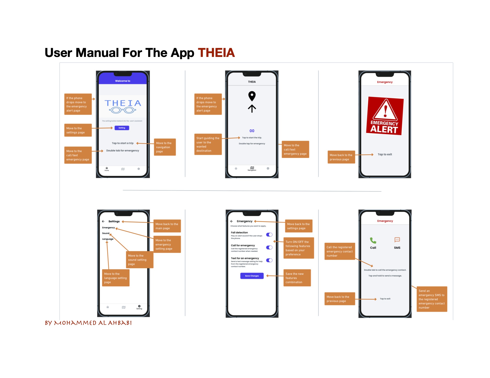

<h1 align="center">Indoor Navigation App for the Visually Impaired - WRS Document</h1>

  

  

  

  

This project is intended to showcase our knowledge learning about Neural Network Design by developing a

# Tools Used / Development Environment
- Google Docs (Draft)
- Microsoft Word (Final Draft)
- Windows 10

# Team / Contributors / Teachers
- [Mitchell Kolb](https://github.com/mitchellkolb)
- Wahidullah Rahimi 
- Mohammed Al Ahbabi 
- Callum MacDonald
- Professor. Bolong Zeng

# Project Overview
The objective of this project is to make an app that will assist blind and visually impaired people so they can navigate indoors. We want to be able to help people using our design. This will be done by using the agile process where we will establish the requirements, design, test and deploy our prototype. The application will be using things such as voice over and assistive technology in order to make it effective in helping the user. The application implementation will be done using a prototyping software that allows us to test the user interface, as well as design.

## Project Details

### Introduction
In this project, we apply the principles of agile software development to create an indoor navigation app for the blind and visually impaired. Our primary goal is to help these individuals navigate indoor environments safely and efficiently using voice-over and assistive technologies. The app will be prototyped using Figma, allowing us to test and refine the user interface based on user feedback and interaction.

### Literature Review
In developing our app, we drew inspiration from various sources, including existing technologies like Google's Lookout app and navigation aids used in Google Maps for visually impaired users. These sources provided valuable insights into the challenges and solutions in designing accessible navigation systems, helping us to define our project's goals and requirements more clearly.

### Objectives and Success Criteria

- Allow for voice-over navigation.
- Ensure the app works quickly and efficiently.
- Design an intuitive layout for visually impaired users.
- Complete all tasks assigned to each group member.
- Build and test the prototype using Flutterflow.
- Test for non-intended inputs and ensure correct responses.
- Create a save building layout function that can add multiple buildings.
- Ensure users can navigate buildings with minimal obstacles.

### Technical Plan
The project employs a detailed technical plan encompassing both functional and non-functional requirements. Functional requirements include accepting user destination inputs, verifying locations, providing step-by-step navigation instructions, detecting obstacles, and handling emergency situations. Non-functional requirements focus on ensuring safety, usability, affordability, and reliability. The app's design incorporates feedback mechanisms like vibrations and audio cues to guide users and improve their navigation experience.

### Development Process

Our development process followed the Agile methodology, allowing us to iteratively improve the app based on continuous feedback. The main phases included:

- Planning: Establishing project goals, scope, and requirements.
- Analysis: Analyzing user needs and defining system requirements.
- Design: Creating user interface designs and system architecture using Figma.
- Implementation: Developing the app prototype using Flutterflow.
- Testing: Conducting rigorous testing to ensure functionality and usability.
- Deployment: Preparing for the deployment of the final prototype.
- Maintenance: Planning for future updates and improvements.

### Functional and Non-Functional Requirements
Functional Requirements

- Accept user destination inputs.
- Verify destination locations.
- Provide navigation instructions (e.g., distance and direction).
- Detect obstacles and inform the user.
- Handle emergency situations and notify caretakers.

Non-Functional Requirements

- Ensure user safety during navigation.
- Maintain usability and user-friendliness.
- Keep the system cost-effective.
- Allow customization for user preferences.
- Ensure system reliability and robustness.

### Challenges and Solutions

1. Designing a navigation system for varied indoor environments.
Solution: Implementing a customizable layout feature and using user feedback to refine designs.

2. Ensuring the app is accessible and user-friendly for visually impaired users.
Solution: Incorporating voice-over technology and intuitive user interface designs, along with thorough testing with visually impaired individuals.

3. Detecting obstacles accurately and providing real-time updates.
Solution: Initially considered using phone cameras for obstacle detection but opted for a simpler and more reliable solution using predefined safe routes and user feedback mechanisms.

## References
- Lookout: an app to help blind and visually impaired people learn about their surroundings. Blog by Google.
- Professor. Bolong Zeng course material

--- 
# Acknowledgments
This codebase and all supporting materials was made as apart of a course for my undergrad at WSU for CPTS 484 - Software Requirements and Documentation in the Fall of 2022. 